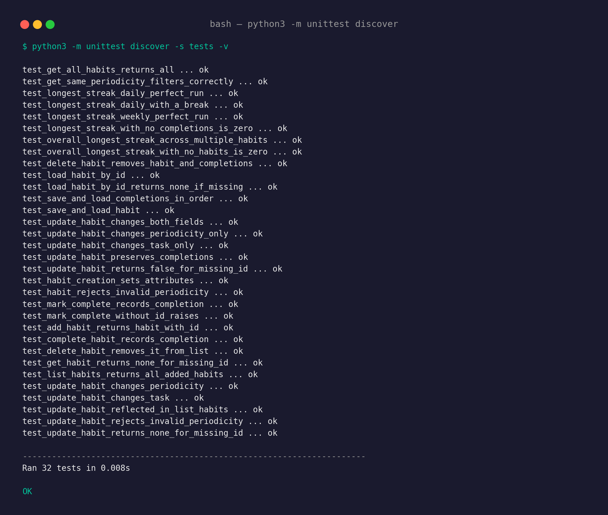
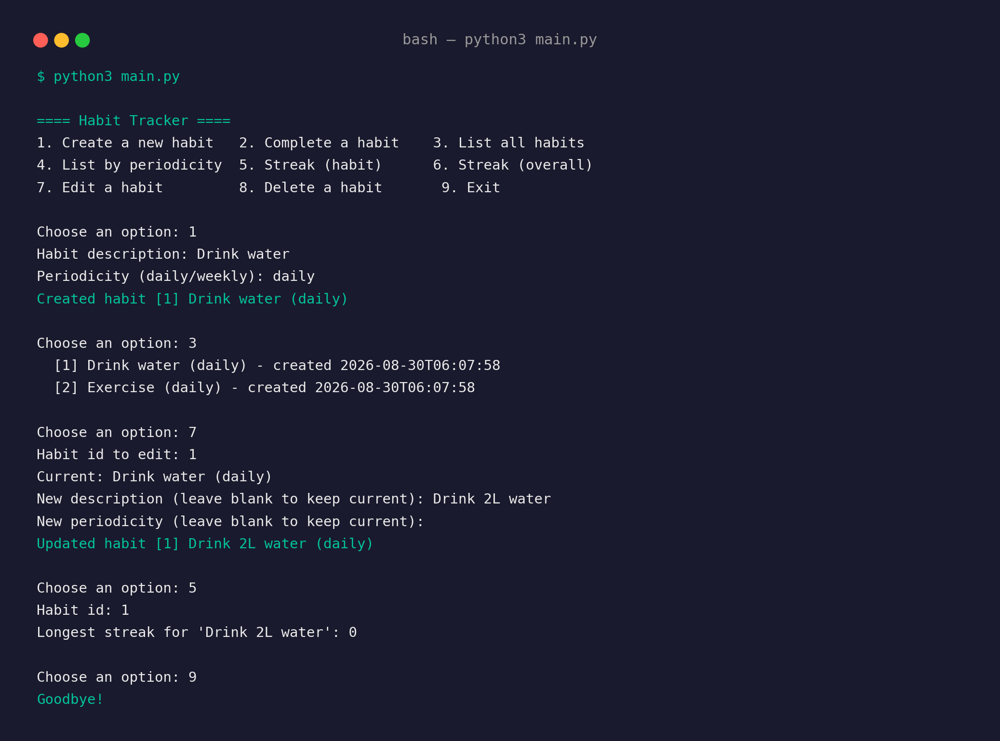

# Habit Tracker

A command-line habit tracking application built with Python, combining
object-oriented programming for habit management and functional
programming for analytics. Data is persisted using SQLite.

## Features

- Create daily or weekly habits
- Edit an existing habit's description and/or periodicity
- Mark habits as complete ("check off") at any time
- List all habits, or filter by periodicity
- Analyse habits: view the longest streak for a single habit, or the
  longest streak across all habits
- Comes with 5 predefined habits and 4 weeks of example completion
  data, ready to use as a test fixture
- Fully covered by an automated unit test suite (32 tests)

## Screenshots

**Unit test suite (32/32 passing):**



**CLI session — create, list, edit, and check a streak:**



## Requirements

- Python 3.7 or later
- No external dependencies — everything used (`sqlite3`, `unittest`,
  `datetime`) is part of the Python standard library

## Project Structure

```
habit_tracker/
├── main.py            Entry point — run this to start the app
├── cli.py              Command-line interface (menu loop)
├── habit.py             Habit class (OOP)
├── tracker.py            HabitTracker class (OOP controller)
├── database.py            SQLite persistence layer (OOP)
├── analytics.py            Functional analytics module
├── seed_data.py            Populates the DB with 5 predefined habits + 4 weeks of data
├── tests/                Unit test suite (unittest)
│   ├── test_habit.py
│   ├── test_database.py
│   ├── test_tracker.py
│   └── test_analytics.py
└── README.md
```

## Installation

1. Ensure Python 3.7+ is installed:
   ```
   python3 --version
   ```
2. Clone or download this repository — no further installation steps
   or third-party packages are required.

## Usage

### 1. Seed the database with example data (recommended for first run)

This creates `habits.db` in the project folder, pre-populated with 5
habits (3 daily, 2 weekly) and 4 weeks of completion history:

```
python3 seed_data.py
```

### 2. Run the application

```
python3 main.py
```

You'll see an interactive menu:

```
==== Habit Tracker ====
1. Create a new habit
2. Complete a habit
3. List all habits
4. List habits by periodicity
5. Show longest streak for a habit
6. Show longest streak overall
7. Edit a habit
8. Delete a habit
9. Exit
```

Enter the number corresponding to the action you want, and follow the
prompts. Habit ids are shown in brackets (e.g. `[1] Drink water`) — use
these ids when completing, deleting, or querying a specific habit.

### 3. Start fresh

To reset all data, simply delete the database file and re-seed:

```
rm habits.db
python3 seed_data.py
```

## Running the Tests

The test suite uses Python's built-in `unittest` framework — no
installation required:

```
python3 -m unittest discover -s tests -v
```

All 32 tests should pass. Tests use an in-memory SQLite database
(`:memory:`), so they run quickly and leave no files behind.

## Design Notes

- **Object-oriented components** (`Habit`, `HabitTracker`, `Database`)
  each have a single, clearly defined responsibility, improving
  testability and maintainability.
- **Functional analytics module** (`analytics.py`) contains only pure
  functions: they accept data as input and return a result without
  modifying application state, making them predictable and easy to
  test in isolation.
- **Streaks are calculated on demand** rather than stored, avoiding
  data duplication and ensuring analytics always reflect the current
  completion history.
